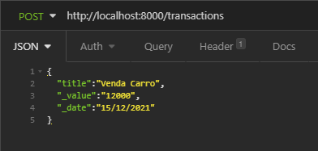
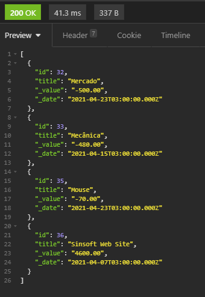
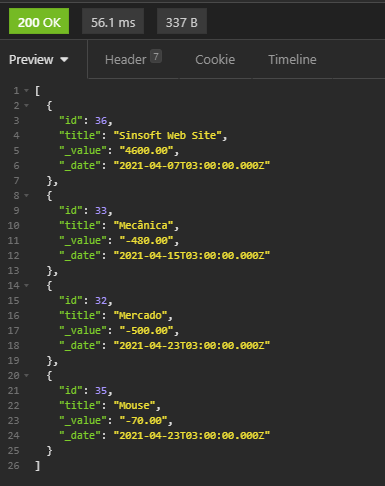
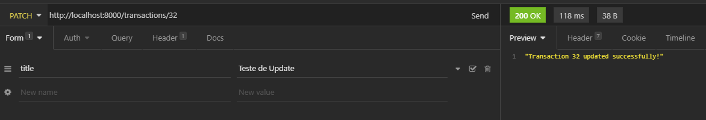
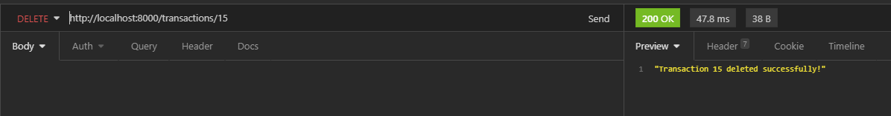

<h1>DevFinancesApi</h1>

<h2>🚀 Technologies</h2>

<ul>
    <li>
        NodeJs
    </li>
    <li>
        TypesCript
    </li>
    <li>
        Express
    </li>
    <li>
        MySql
    </li>
    
</ul>

<h2>💻 Project</h2>

DevFinancesApi is an rest api application for handling personal finances!

We can get, post, put and delete Transactions!

<h3 style="text-align: center;">Post Transactions</h3>

<h3 style="text-align: center;">Get Transactions</h3>

http://localhost:8000/transactions

http://localhost:8000/transactions/36

http://localhost:8000/transactions/_value

http://localhost:8000/transactions/_date

   

http://localhost:8000/transactions/_date

   
<h3 style="text-align: center;">Patch Transactions</h3>

http://localhost:8000/transactions/32

   
<h3 style="text-align: center;">Delete Transactions</h3>

http://localhost:8000/transactions/32

    
<h2>📝 How to Use</h2>

<ol>
<li><a href="https://nodejs.org/en/">Get node</a></li>
<li><a href="https://aws.amazon.com/pt/rds/mysql/?trk=ps_a131L0000083bBMQAY&trkCampaign=pac_ps_Q1_120_RDS_PDP_P_NBrand_BR&sc_channel=ps&sc_campaign=pac_q1-1-2020_paidsearch_RDS_OpenSource_BR&sc_outcome=PaaS_Digital_Marketing&sc_geo=LATAM&sc_country=BR&sc_publisher=Google&sc_category=Database&sc_detail=%2Bmysql&sc_content=mysql_bmm&sc_matchtype=b&sc_segment=448671285798&sc_medium=PAC-PaaS-P|PS-GO|Non-Brand|Desktop|PA|Database|RDS|BR|PT|Text&s_kwcid=AL!4422!3!448671285798!b!!g!!%2Bmysql&ef_id=Cj0KCQjwyZmEBhCpARIsALIzmnIMbk7qeSgLtTZ2Fd5K3fOSDZQgqrFX5ogO-Gf6Wa4Dh1HL7tioJTAaAjNqEALw_wcB:G:s&s_kwcid=AL!4422!3!448671285798!b!!g!!%2Bmysql">Get MySql</a></li>
<li>Alter credentials on database.ts </li>
<li>Run database.sql </li>
<li><code>git clone https://github.com/RicardinhoFilho/dev_finances_api</code></li>
<li><code>npm i</code></li>
<li><code>npm run dev</code></li>
<ol>

